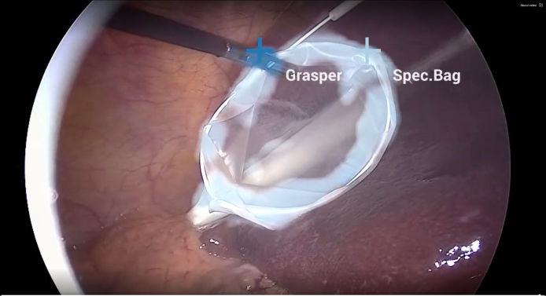

# Endoscopy Tool Tracking

This application demonstrates real-time AI-powered tool detection and tracking in endoscopic video streams.

##Known Issues
 - Only the C++ version of the app is currently working 
 - It requires an AJA Capture card with hardware keying

## Overview

Digital endoscopy is a key technology for medical screenings and minimally invasive surgeries. Using real-time AI workflows to process and analyze the video signal produced by the endoscopic camera, this technology helps medical professionals with anomaly detection and measurements, image enhancements, alerts, and analytics.

  
_Fig. 1 Endoscopy (laparoscopy) image from a cholecystectomy (gallbladder removal surgery) showing AI-powered frame-by-frame tool identification and tracking. Image courtesy of Research Group Camma, IHU Strasbourg and the University of Strasbourg ([NGC Resource](https://catalog.ngc.nvidia.com/orgs/nvidia/teams/clara-holoscan/resources/holoscan_endoscopy_sample_data))_

The Endoscopy tool tracking application provides an example of how an endoscopy data stream can be captured and processed using the C++ or Python APIs on multiple hardware platforms.


#### Building
```bash
./holohub build cpp endoscopy_tool_tracking_aja_multi_ch
```
#### Hardware keying
This application overlay the segmentation results on the input video on the AJA card FPGA. The overlay layer is sent from [Holoviz](https://docs.nvidia.com/holoscan/sdk-user-guide/holoscan_operators_extensions.html#operators) back to the [AJA Source](https://docs.nvidia.com/holoscan/sdk-user-guide/holoscan_operators_extensions.html#operators) operator which handles the alpha blending and outputs it to a port of the the AJA card. The blended image is also sent back to the [Holoviz](https://docs.nvidia.com/holoscan/sdk-user-guide/holoscan_operators_extensions.html#operators) operator (instead of the input video only) for rendering the same image buffer.

