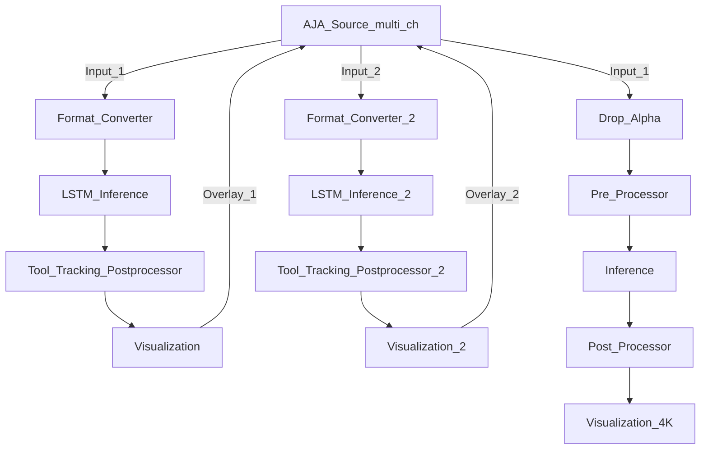

# Endoscopy Tool Tracking

Based on a LSTM (long-short term memory) stateful model, these applications demonstrate the use of custom components for tool tracking, including composition and rendering of text, tool position, and mask (as heatmap) combined with the original video stream.


### Known Issues

Python implementaion is currently not working. Use C++ Implementation
This app is modified to use multippel video streams and it only works with AJA cards that support overlays

### Requirements

Follow the [setup instructions from the user guide](https://docs.nvidia.com/holoscan/sdk-user-guide/aja_setup.html) to use the AJA capture card.


### Application workflow diagram



### Run Instructions

```
./holohub run --language cpp endoscopy_tool_tracking_aja_multi_ch

```